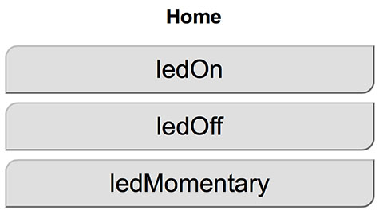

# OmEspHelpers #

This library presents a very simple API for bringing up a web interface on your 
*Arduino ESP8266* project. In its present form it is appropriate for:

* Quick experiments
* Beginner exercises
* Simple projects and products

If you need total flexibility and total control, this library may be too limited for you.
But if you'd like to be freed from infinite choice, and get something running this afternoon, I think you'll be delighted!

## Features ##

| Name                | Description |
| ------------------- | ----------- |
| Non blocking        | A single tick() function does everything, never blocking |
| Fast start          | Your main loop can be running other things, even while the initial wifi connection is established |
| Connection management | Connection will be retried if lost |
| Multiple WiFi credentials | You can specify a list of different WiFi credentials to try |
| Basic UI elements   | With one line of code each, you can add buttons, sliders, or page links |
| Custom HTML         | You can write a callback to provide custom content, such as a status page |
| No stored pages     | To simplify development, you write only your sketch, no handwritten HTML pages |
| Mobile ready        | The generated HTML works well on your phone, and is fine on desktop. |
| LED status          | By default, LED_BUILTIN blinks out the last part of the device's IP address. Also flashes for network activity |
| Easy to use         | The example below shows how a dozen lines of code or less brings up your IoT user interface in a browser |
| Conformant HTML     | The generated HTML passes https://validator.w3.org/

## More Features 2020 ##

| Name                | Description |
| ------------------- | ----------- |
| Time Service        | Use NTP for time service |
| OTA Update          | With three additional lines of code, add "Over The Air" update to your device. No need for USB cable after the first upload! |
| Unlimited HTML size | Page results can be generated at request time for any size (great for XML data dumps)|
| Bitmaps             | You can generate uncompressed BMP images in you page request handler (1- or 24-bit) |
| More UI Elements    | Time, Color, Menu Select, and Checkboxes are supported |
| URL Handler         | If you really want, you can still intercept specific URLs and return whatever you like. |
| ESP32 Support       | Finally! |

## Platforms ##

Tested on Wemos D1 Mini, and several versions of ESP32 boards.

## Installation ##

1. Download and expand the zip file of this project.
1. Rename the folder from OmEspHelpers-master to just OmEspHelpers. 
1. Put OmEspHelpers/ into the Arduino libraries folder, like `.../Documents/Arduino/libraries/OmEspHelpers/` on Mac.
1. You can read the headers and source in `.../OmEspHelpers/src`.

## Example ##

Here is an example sketch which brings up a Web Controlled LED.

```
#include "OmEspHelpers.h"
#include "OmWebServer.h"
#include <ESP8266WebServer.h>
#include <ESP8266WiFi.h>

void buttonProc(const char *page, const char *item, int value, int ref1, void *ref2)
{
    digitalWrite(LED_BUILTIN, ref1);
}

void buttonMomentaryProc(const char *page, const char *item, int value, int ref1, void *ref2)
{
    digitalWrite(LED_BUILTIN, !value);
}

OmWebPages p;
OmWebServer s;

void setup() 
{
  Serial.begin(115200);
  Serial.print("\n\nHello OmEspHelpers\n");

  p.beginPage("Home");
  p.addButton("ledOn", buttonProc, 0); // ref=0
  p.addButton("ledOff", buttonProc, 1); // ref=1
  p.addButton("ledMomentary", buttonMomentaryProc);
  
  s.addWifi("omino warp", ""); // my home network, no password
  // or setup an AP instead
  // s.setAccessPoint(WIFI_AP_SSID, WIFI_AP_PASSWORD);
  s.setHandler(p);
  s.setStatusLedPin(-1); // tell the server not to blink the led; this app uses it.

  pinMode(LED_BUILTIN, OUTPUT);
  digitalWrite(LED_BUILTIN, 1); // off
}

void loop() 
{
  s.tick(); // in turn calls OmWebPages
  delay(20);
}
```

When running the sketch, I see the following on the serial monitor:

```
0x2d
csum 0x2d
v7b32e6ad
~ld


Hello OmEspHelpers
  15.53 (*) OmWebServer.80: On port 80
  15.62 (*) OmWebServer.80: Attempting to join wifi network "omino warp"
  22.34 (*) OmWebServer.80: Joined wifi network "omino warp"
  22.34 (*) OmWebServer.80: Accessible at http://10.0.3.126:80
  28.40 (*) OmWebServer.80: Request from 114.3.0.10:60383 /
  28.40 (*) OmWebServer.80: Replying 2277 bytes
  30.55 (*) OmWebServer.80: Request from 114.3.0.10:60386 /Home
  30.57 (*) OmWebServer.80: Replying 2977 bytes
  ...and so on ...
```

And when I point my browser at http://10.0.3.126:80 I see a simple UI:


